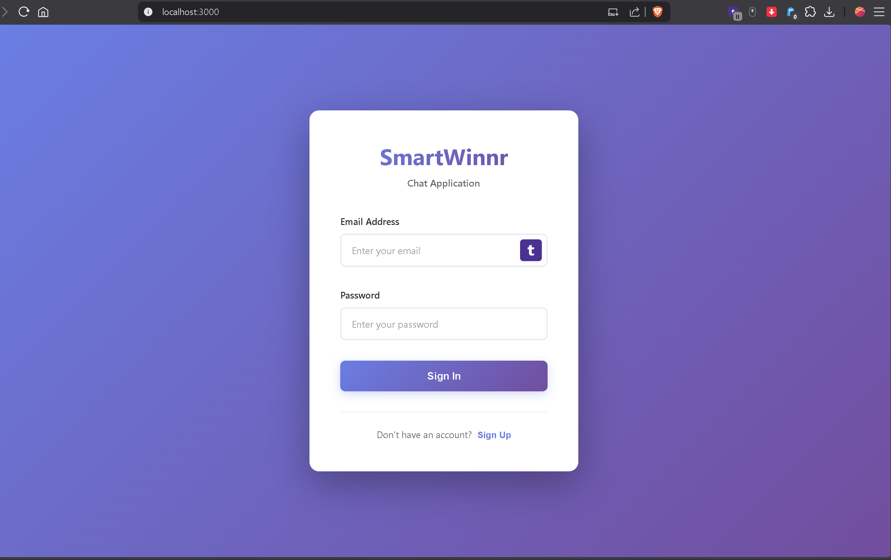
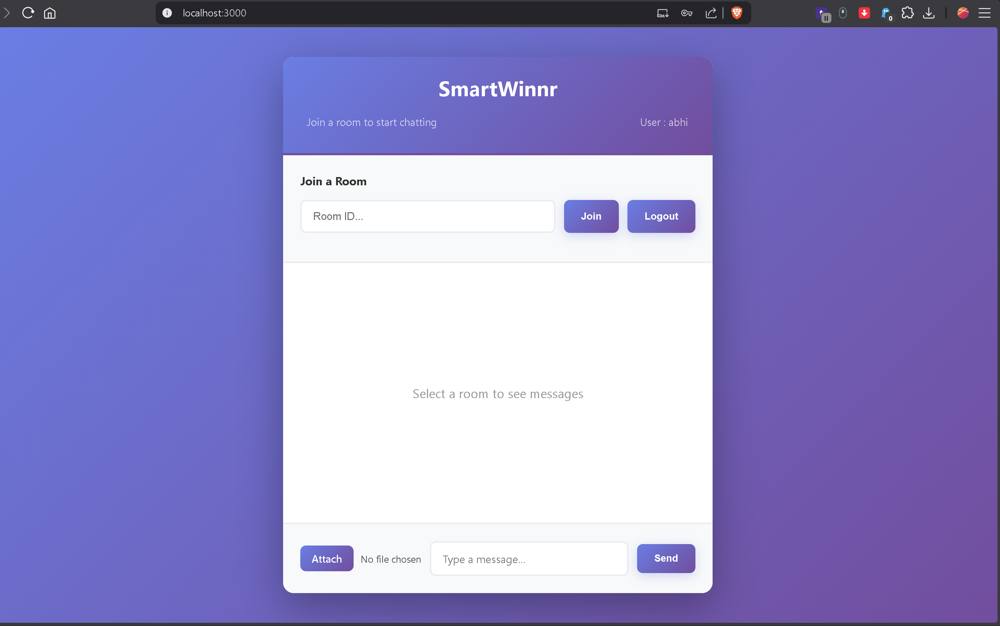
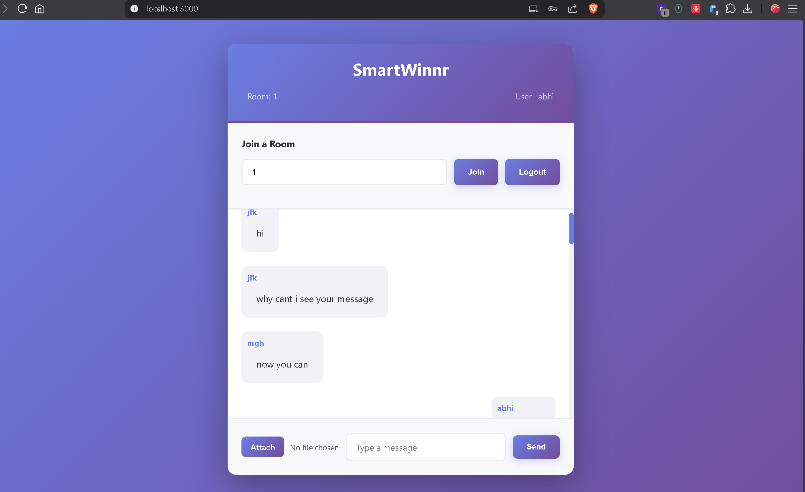
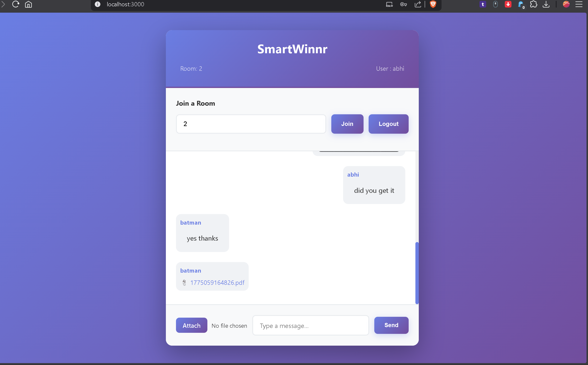
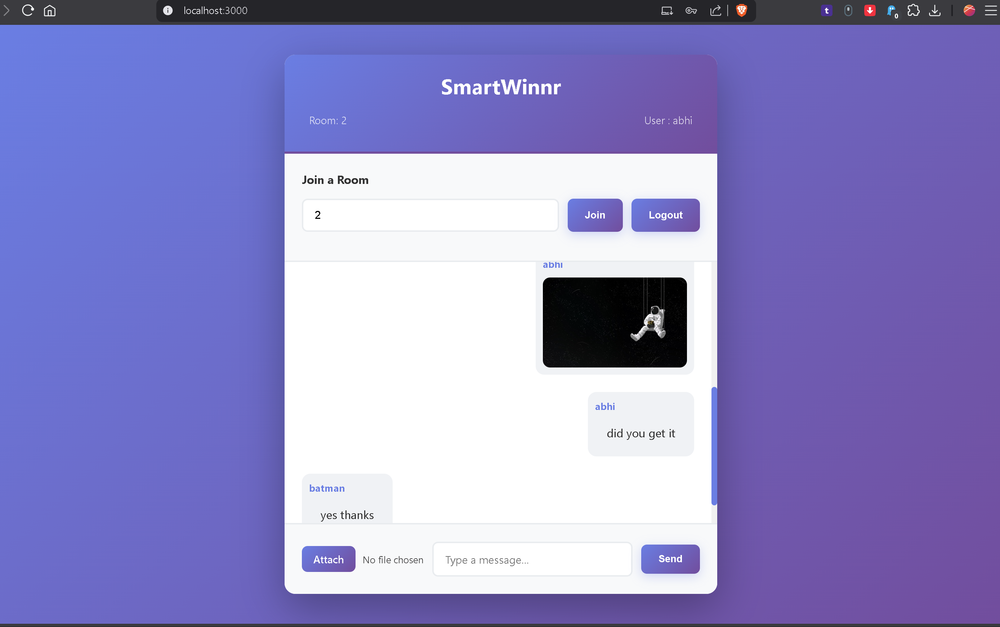
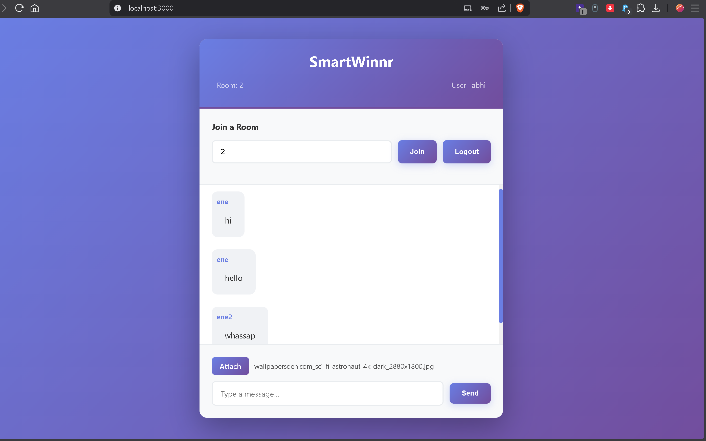

# Chat_app
# 💬 Real-Time Chat Application (MERN + Socket.io)

## 🚀 Overview

This is a full-stack real-time chat application built using the MERN stack and Socket.io. It supports instant messaging, room-based communication, user authentication, message persistence, and file/media sharing.

---

## 📸 Screenshots

### 🔐 Login Page


### 👥 Rooms


### 💬 Chat Interface




### 📎 File Upload


## 🛠️ Tech Stack

### Frontend

* React.js
* Axios
* Socket.io-client

### Backend

* Node.js
* Express.js
* Socket.io
* Multer (for file uploads)
* bcrypt (for password hashing)

### Database

* MongoDB (Mongoose)

---

## ✨ Features

* 🔴 Real-time messaging using WebSockets (Socket.io)
* 👥 Room-based chat system
* 💾 Message persistence with MongoDB
* 🔐 User authentication (Signup/Login with bcrypt)
* 📎 File and image sharing (stored locally using Multer)
* 📜 Chat history loading on room join
* ⚡ Instant updates across multiple users/tabs

---

## 📂 Project Structure

```
chat-app/
│
├── client/        # React frontend
│   ├── src/
│   └── .env
│
├── server/        # Node + Express backend
│   ├── models/
│   ├── sockets/
│   ├── uploads/   # Uploaded files
│   └── .env
```

---

## ⚙️ Setup Instructions (Local Development)

### 🔹 Prerequisites

Make sure you have:

* Node.js (v18 or above recommended)
* npm (comes with Node)
* MongoDB (local or cloud - MongoDB Atlas)

---

## 🔧 1. Clone the Repository

```bash
git clone <your-repo-url>
cd chat-app
```

---

## 🔧 2. Backend Setup

```bash
cd server
npm install
```

### Create `.env` in `server/`

```env
MONGO_DB_URL=mongodb://localhost:27017/chat-app
BASE_URL=http://localhost:5000
PORT=5000
```

### Start Backend

```bash
node server.js
```

---

## 🔧 3. Frontend Setup

```bash
cd ../client
npm install
```

### Create `.env` in `client/`

```env
REACT_APP_SOCKET_URL=http://localhost:5000
```

### Start Frontend

```bash
npm start
```

---

## 🌐 Access the App

* Frontend → http://localhost:3000
* Backend → http://localhost:5000

---

## 🔄 How It Works

1. User signs up or logs in
2. Joins a chat room
3. Messages are sent via Socket.io (real-time)
4. Messages are stored in MongoDB
5. When a user joins a room, previous messages are fetched
6. Files/images are uploaded using Multer and shared via URL

---

## 🔐 Authentication Flow

* Passwords are hashed using bcrypt before storing
* Login verifies password using bcrypt.compare
* No plain-text password storage

---

## 📎 File Upload Handling

* Files are uploaded via `/upload` endpoint
* Stored locally in `/uploads`
* File URL is sent via Socket.io
* Rendered dynamically in chat UI

---

## 💡 Future Improvements

* JWT-based authentication
* Online users indicator
* Typing indicator
* Cloud storage (AWS S3 / Cloudinary)
* Group chat management
* Message timestamps & read receipts

---

## 🎯 Learning Outcomes

* Implemented real-time communication using WebSockets
* Understood full-stack architecture (MERN)
* Integrated file upload and media handling
* Applied secure authentication using bcrypt
* Built scalable backend with room-based messaging

---

## 🧑‍💻 Author

* Developed by: *Sai Abhinav*

---
